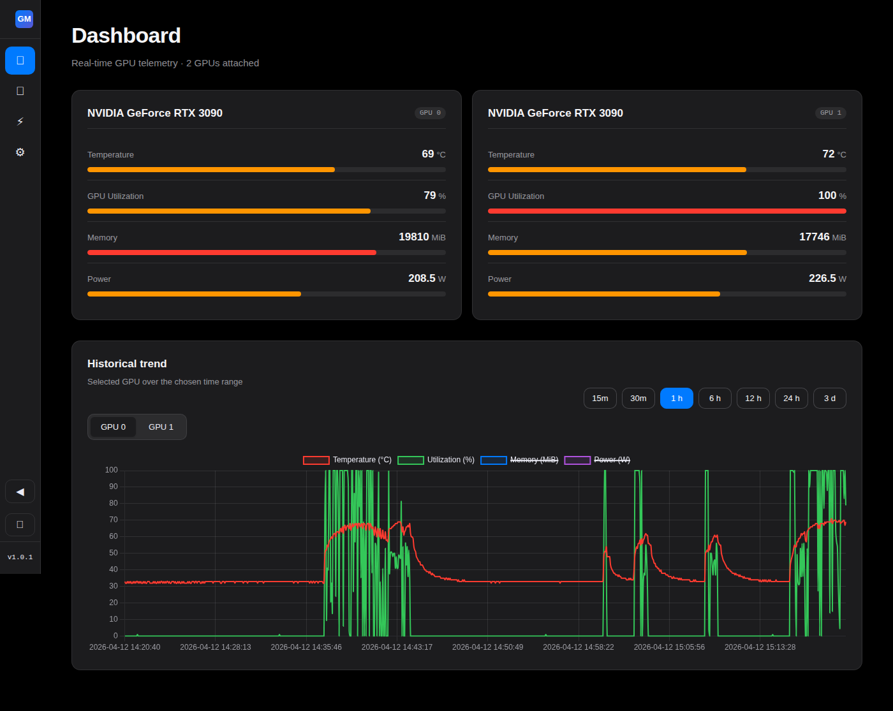
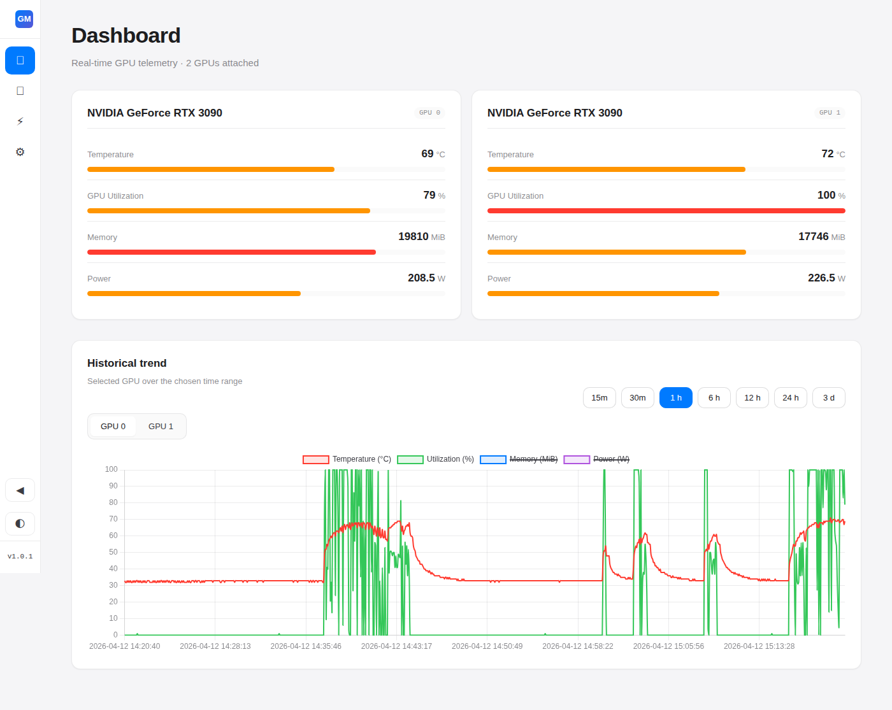
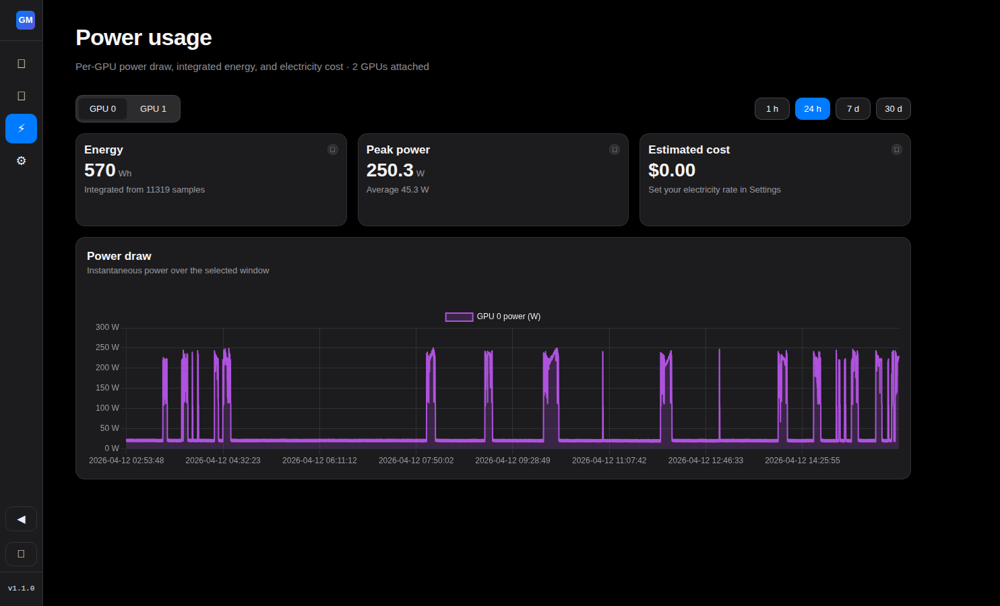
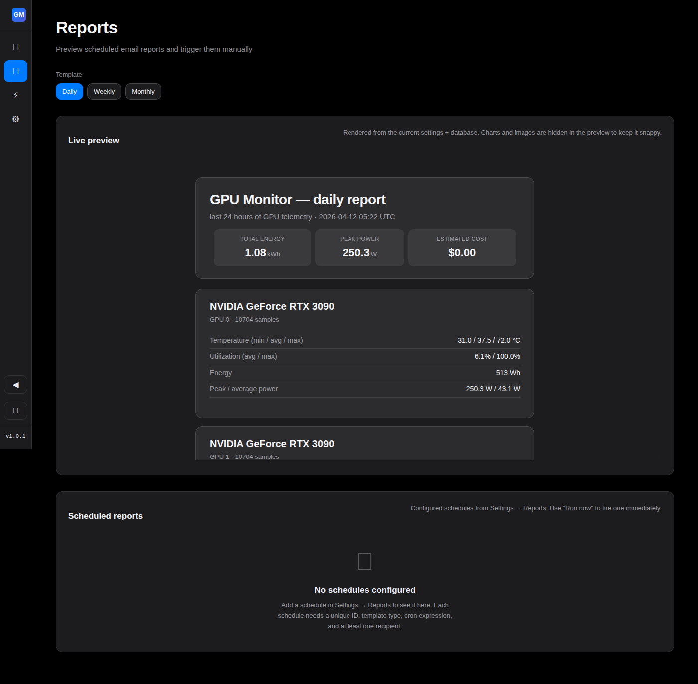
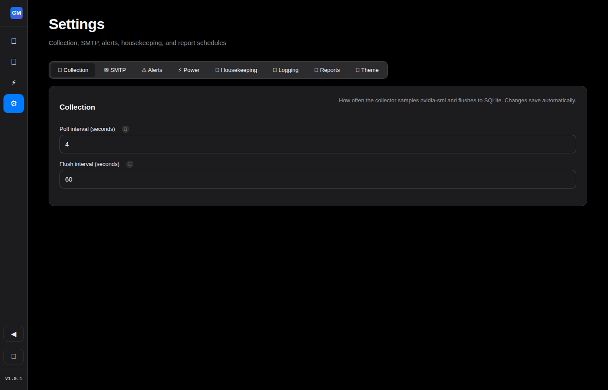

[](https://opensource.org/licenses/MIT)

# GPU Monitor

Real-time NVIDIA GPU telemetry dashboard with multi-GPU support,
scheduled HTML email reports, electricity-cost tracking, and a
live Apple-HIG-themed web UI. Ships as a single Docker container.

<p align="center">
  
</p>

<p align="center">
  <em>Dashboard with 2× NVIDIA RTX 3090 — real-time gauges, historical trend chart, Apple HIG dark theme</em>
</p>

> **This is a fork of [`bigsk1/gpu-monitor`](https://github.com/bigsk1/gpu-monitor)**
> with enormous thanks to the original author. The upstream project
> provided the original bash + SQLite collector, the nvidia-smi polling
> loop, and the original HTML dashboard. This fork takes that
> foundation and rebuilds it into a multi-GPU, multi-theme, API-first
> tool with emailed reporting and settings persistence. See
> [How this fork differs](#how-this-fork-differs) below.

---

## How this fork differs

| Feature | Upstream `bigsk1/gpu-monitor` | This fork |
|---|---|---|
| GPU support | Single GPU (first card only) | Multi-GPU with per-card tabs and aggregates |
| Frontend | Single 1,200-line HTML file with inlined CSS + JS | ES modules + Lit web components + design tokens |
| Theme | Dark navy | Apple-HIG light + dark + auto (OS preference) |
| Navigation | Single page | Sidebar with Dashboard / Report / Power / Settings |
| API | Flat-file JSON served from disk | REST endpoints backed by read-only SQLite (WAL) |
| Settings | Browser localStorage only | `/app/settings.json` with Pydantic validation + live-reload |
| Reports | None | Scheduled HTML email with matplotlib PNG charts via SMTP |
| Push notifications | None | **ntfy.sh, Pushover, webhook, email alerts** — server-side 24/7 |
| Electricity cost | None | `kWh × rate` on the Power view + in emailed reports |
| Housekeeping | Nightly collector sweep only | + UI-triggered VACUUM and manual purge endpoints |
| Docker registry | Docker Hub | **GHCR only** (`ghcr.io/tekgnosis-net/gpu-monitor`) |
| Versioning | Latest tag on main | Semver releases via release-please, signed images with SBOM |

The upstream project is excellent at what it does — a drop-in
single-GPU monitor you can run in 30 seconds. This fork trades
that simplicity for a larger feature surface that suits multi-GPU
homelabs, emailed usage reports, and hands-off scheduled
deliveries. Pick the version that matches your use case.

---

## Features

### Dashboard
- **Multi-GPU layout**: tab strip when more than one card, classic
  single-card view otherwise
- **Real-time gauges**: temperature / utilization / memory / power
  per GPU, polling every 4 s (configurable 2–300 s)
- **Historical chart**: 15 m / 30 m / 1 h / 6 h / 12 h / 24 h / 3 d / 7 d
  time ranges, backed by SQLite WAL
- **Apple HIG-inspired theme** with auto / light / dark mode that
  tracks OS preference via `matchMedia`

### Power view
- **Integrated energy** (Wh / kWh) from `SUM(power × interval_s)`
  — correct across runtime changes to the poll interval because
  each sample records the cadence it was captured at
- **Peak and average power** over selectable 1 h / 24 h / 7 d / 30 d
  windows
- **Electricity cost tile** computed from a configurable rate per
  kWh (currency symbol configurable too)
- **Insufficient-telemetry warnings** when some samples had
  missing power data, so the energy total is honest about being
  a lower bound

### Scheduled email reports
- **Cron-driven scheduler** task running as part of the unified
  asyncio entrypoint. Uses `croniter.get_prev()` so a container offline
  during a scheduled slot fires once on startup (not N times for
  N missed days)
- **Multipart/alternative messages** with plain-text fallback and
  HTML body containing embedded PNG charts (temperature + power)
  per GPU, rendered by matplotlib with Apple-HIG palette
- **SMTP support** for STARTTLS / implicit TLS / plain, with
  password encrypted at rest via Fernet (key in env var or
  auto-generated in `/app/history/.secret` mode 0600)
- **Test email** button in Settings for immediate validation

### Push notifications (server-side 24/7)
- **Fires even when nobody has the browser open** — a dedicated
  alert checker process evaluates thresholds every 30 s
  (configurable 5–300 s) against the latest DB metrics
- **Four channels**, independently enable/disable-able:
  - **ntfy.sh** — open-source push notifications (cloud + self-hosted
    with token auth)
  - **Pushover** — popular mobile push service with iOS/Android apps
  - **Generic webhook** — configurable HTTP POST/PUT with custom
    headers and `{{key}}` body template substitution
  - **Email alerts** — short plain-text emails reusing existing SMTP
- **Parallel dispatch** — all enabled channels fire concurrently;
  one dead channel doesn't block others
- **Per-channel Test buttons** in Settings for instant validation
- **Secrets encrypted at rest** (Fernet) — ntfy tokens, Pushover
  keys, webhook auth tokens never exposed via the API

### Settings
- 8-tab form: **Collection / SMTP / Alerts / Power / Housekeeping
  / Logging / Reports / Theme**
- **macOS-style autosave** — every field saves on change/blur with
  a floating toast for feedback; no Save buttons
- **Live-reload** for collection cadence, log rotation, and data
  retention — changes apply on the next tick/hour/day without a
  container restart
- **Info-tips** on every non-obvious field with `<info-tip>` Lit
  component
- **Alert thresholds**: temperature / utilization / power with
  configurable cooldown, sound, browser Notification opt-in, and
  server-side push notification channels
- **Inline schedule editing** — edit template, cron, recipients,
  and custom email subject without deleting and recreating
- **Database housekeeping**: live size + row count display,
  manual VACUUM button, purge-older-than-N-days with confirmation
- **Settings persist across upgrades** — stored in the Docker
  volume alongside the database, not inside the ephemeral container

### API (`/api/*`)
```
GET  /api/health                       ok + version + schema
GET  /api/version                      {version}
GET  /api/gpus                         inventory with per-card metadata
GET  /api/metrics/current              latest sample per GPU
GET  /api/metrics/history?range=24h&gpu=0   timeseries
GET  /api/stats/24h                    per-GPU min/max
GET  /api/stats/power?range=24h&gpu=0  energy + peak + avg
GET  /api/settings                     current settings (password redacted)
PUT  /api/settings                     partial-merge update
POST /api/settings/smtp/test           send test email
POST /api/alerts/test/{channel}        test one notification channel
POST /api/schedules/{id}/run-now       fire one schedule synchronously
GET  /api/reports/preview              rendered HTML for iframe preview
GET  /api/housekeeping/db-info         size + row count + per-GPU
POST /api/housekeeping/vacuum          run SQLite VACUUM
POST /api/housekeeping/purge           delete rows older than N days
```

---

## Screenshots

<details>
<summary><strong>Dashboard — light mode</strong></summary>
<p align="center">
  
</p>
</details>

<details>
<summary><strong>Power usage</strong></summary>
<p align="center">
  
</p>
</details>

<details>
<summary><strong>Report preview</strong></summary>
<p align="center">
  
</p>
</details>

<details>
<summary><strong>Settings</strong></summary>
<p align="center">
  
</p>
</details>

---

## Quick start

### Prerequisites
- Docker with the NVIDIA Container Toolkit installed
  ([install guide](https://docs.nvidia.com/datacenter/cloud-native/container-toolkit/latest/install-guide.html))
- An NVIDIA GPU with a working `nvidia-smi` on the host

### Run the latest stable release

```bash
docker run -d \
  --name gpu-monitor \
  --gpus all \
  -p 8081:8081 \
  -e TZ=Etc/UTC \
  -v gpu-monitor-history:/app/history \
  -v gpu-monitor-logs:/app/logs \
  ghcr.io/tekgnosis-net/gpu-monitor:latest
```

Then open `http://<host>:8081/`.

### Pin to a specific version

```bash
docker run -d \
  --name gpu-monitor \
  --gpus all \
  -p 8081:8081 \
  ghcr.io/tekgnosis-net/gpu-monitor:1.0.0
```

Available image tags:

| Tag | Points to |
|---|---|
| `:latest` | Most recent stable release (rolling) |
| `:1.0.0` | Exact version (immutable) |
| `:1.0` | Latest patch of the 1.0 minor line |
| `:1` | Latest minor of the 1.x major line |
| `:main` | Latest dev build from main (not guaranteed stable) |
| `:main-<sha>` | Immutable per-commit dev build |

### Docker Compose

```yaml
services:
  gpu-monitor:
    image: ghcr.io/tekgnosis-net/gpu-monitor:latest
    container_name: gpu-monitor
    ports:
      - "8081:8081"
    volumes:
      - gpu-monitor-history:/app/history
      - gpu-monitor-logs:/app/logs
    environment:
      - TZ=Etc/UTC
    restart: unless-stopped
    deploy:
      resources:
        reservations:
          devices:
            - driver: nvidia
              count: all
              capabilities: [gpu]

volumes:
  gpu-monitor-history:
  gpu-monitor-logs:
```

---

## Configuration

All user-facing configuration lives in `/app/settings.json` inside
the container and is managed via the **Settings** page of the web
UI. The file is created on first launch with sensible defaults
matching the pre-v1.0.0 container's behavior, so a fresh install
needs no configuration to start working.

### Full settings reference

```json
{
  "collection": {
    "interval_seconds": 4,
    "flush_interval_seconds": 60
  },
  "housekeeping": {
    "retention_days": 3
  },
  "logging": {
    "max_size_mb": 5,
    "max_age_hours": 25
  },
  "alerts": {
    "temperature_c": 80,
    "utilization_pct": 100,
    "power_w": 300,
    "cooldown_seconds": 10,
    "sound_enabled": true,
    "notifications_enabled": false
  },
  "power": {
    "rate_per_kwh": 0.0,
    "currency": "$"
  },
  "smtp": {
    "host": "",
    "port": 587,
    "user": "",
    "password_enc": "(Fernet-encrypted)",
    "from": "",
    "tls": "starttls"
  },
  "schedules": [
    {
      "id": "daily-0800",
      "template": "daily",
      "cron": "0 8 * * *",
      "recipients": ["ops@example.com"],
      "enabled": true,
      "last_run_epoch": null
    }
  ],
  "theme": { "default_mode": "auto" }
}
```

### Live-reload scope

Fields that apply **without a container restart**:
- `collection.interval_seconds` — next poll tick
- `collection.flush_interval_seconds` — next buffer flush
- `logging.max_size_mb` / `logging.max_age_hours` — next hourly rotation
- `housekeeping.retention_days` — next nightly sweep
- All `alerts.*` — next dashboard poll (4 s)
- All `smtp.*` and `schedules` — next scheduler tick (60 s)

### Timezone

Set the `TZ` environment variable on the container to control
clock display in the UI and cron evaluation in the scheduler. The
slim base image ships without the full `tzdata` package — if you
set `TZ=America/Los_Angeles` and see `ZoneInfoNotFoundError` in
the scheduler log, install `tzdata` via a custom build:

```dockerfile
FROM ghcr.io/tekgnosis-net/gpu-monitor:latest
RUN apt-get update && apt-get install -y tzdata && rm -rf /var/lib/apt/lists/*
```

The scheduler falls back to UTC on an unknown TZ so it never
crashes — but cron expressions will evaluate in UTC instead of
your local timezone.

---

## Security / threat model

**This container is designed for trusted LAN deployment only.**
There is no authentication, no authorization, and no network-level
encryption on the HTTP endpoints. If your GPU monitor is reachable
from the public internet, put it behind a reverse proxy that
provides TLS + auth (nginx + basic auth, Caddy + Authelia,
Cloudflare Access, Tailscale private network, etc).

### What's encrypted

- **SMTP password**: Fernet symmetric encryption at rest. Key
  lives in the `GPU_MONITOR_SECRET` env var if set, otherwise
  auto-generated at `/app/history/.secret` mode 0600. If you
  lose the key file and don't have the env var, you must re-enter
  the SMTP password via the Settings view.

### What's not encrypted

- All other fields in `settings.json` — collection cadence,
  alert thresholds, electricity rate, schedules, recipients —
  are stored as plaintext. These are not sensitive individually
  but document your monitoring configuration.
- `gpu_metrics.db` is a standard SQLite file. Per-sample GPU
  telemetry is stored in the clear.
- HTTP endpoints serve plaintext. A reverse proxy provides TLS.

### Same-origin defense

All mutating API routes (`PUT /api/settings`, `POST /api/*`) check
the `Origin` header against the `Host` header and reject cross-
origin requests with 403. This prevents drive-by CSRF attacks
from a malicious page on another domain opened in the same
browser. It does not protect against a malicious client on the
same LAN.

---

## Upgrading from `bigsk1/gpu-monitor`

1. **Back up your `history/gpu_metrics.db`** — the v1.0.0
   migration is one-way (adds `gpu_index` / `gpu_uuid` /
   `interval_s` columns, switches to WAL journal mode, adds a
   composite index). Downgrading to a pre-v1.0.0 image will fail
   because the upstream collector doesn't understand the new
   columns.

2. **Change your image tag** from `bigsk1/gpu-monitor` to
   `ghcr.io/tekgnosis-net/gpu-monitor:1.0.0`.

3. **Mount the same volumes** — `/app/history` and `/app/logs`.
   Existing rows are preserved and attributed to `gpu_index = 0`
   with `gpu_uuid = 'legacy-unknown'` after the migration.

4. **First launch runs the migration automatically** — no manual
   step required. The Python collector's `gpu_monitor.db.migrate()`
   function is idempotent and runs at startup. (Pre-v2.0.0 images
   used a bash equivalent; the migration logic is identical.)

5. **Check the sidebar footer** — it should show `v1.0.0`. If
   you see `v1.0.0-dev` or an older version, check that the
   image you're running matches the GHCR tag you pulled.

---

## Development

### Architecture at a glance

```
┌─────────────────────────────────────────────────────────────────┐
│  python3 -m gpu_monitor    (single PID, asyncio event loop)     │
│                                                                 │
│  ┌─ collector ───┐  ┌─ aiohttp ─────┐  ┌─ scheduler ─────────┐  │
│  │ NVML sample   │  │ /api/* +      │  │ cron eval → render  │  │
│  │ → SQLite WAL  │  │ static files  │  │ → mailer (60s tick) │  │
│  │ (per-tick)    │  │ + settings    │  └─────────────────────┘  │
│  └───────────────┘  │ CRUD          │                           │
│  ┌─ alert-checker ┐  │ + housekeeping│  ┌─ housekeeping ──────┐ │
│  │ threshold      │  └───────────────┘  │ log rotation hourly │ │
│  │ state machine  │                     │ DB purge daily 00:00│ │
│  └────────────────┘                     └─────────────────────┘ │
└─────────────────────────────────────────────────────────────────┘
                              │
                              ▼
                  ┌─────────────────────────┐
                  │ /app/history/           │
                  │   gpu_metrics.db (WAL)  │
                  │   settings.json         │
                  └─────────────────────────┘
```

v2.0.0 unified the four-process tree into a single asyncio process.
NVML telemetry is sampled directly via `nvidia-ml-py` (no
`nvidia-smi` subprocess fork per tick), and all five tasks share one
event loop, settings cache, and DB connection pool. SQLite WAL mode
keeps the aiohttp readers free of contention with the collector
writer.

### Running the test suite

```bash
# In a throwaway python:3.11-slim container
docker run --rm -v "$PWD":/app -w /app python:3.11-slim sh -c '
  pip install --quiet \
    aiohttp pytest pytest-asyncio pydantic cryptography \
    aiosmtplib jinja2 premailer matplotlib croniter &&
  python -m pytest -q
'
```

90+ tests cover the API, crypto, settings, scheduler,
housekeeping, email rendering, and mailer.

### Building locally

```bash
docker build \
  -f docker/Dockerfile \
  --build-arg APP_VERSION=$(cat VERSION) \
  -t gpu-monitor:local \
  .
```

---

## License

MIT. See [LICENSE](LICENSE). The original GPU-polling architecture
is derived from the upstream
[`bigsk1/gpu-monitor`](https://github.com/bigsk1/gpu-monitor)
project by [@bigsk1](https://github.com/bigsk1) and retains its
original MIT license — though as of v2.0.0 the bash collector has
been replaced wholesale with an async Python implementation using
`nvidia-ml-py`. All additions in this fork (the REST API,
the frontend rewrite, the reporting subpackage, the settings
system) are original work under the same license.

## Acknowledgements

- **[@bigsk1](https://github.com/bigsk1)** for the original
  `gpu-monitor` project this fork builds on
- **Apple** for the Human Interface Guidelines palette and
  typography conventions the UI borrows from
- **The Python, aiohttp, Pydantic, matplotlib, and Lit
  communities** for the building blocks
